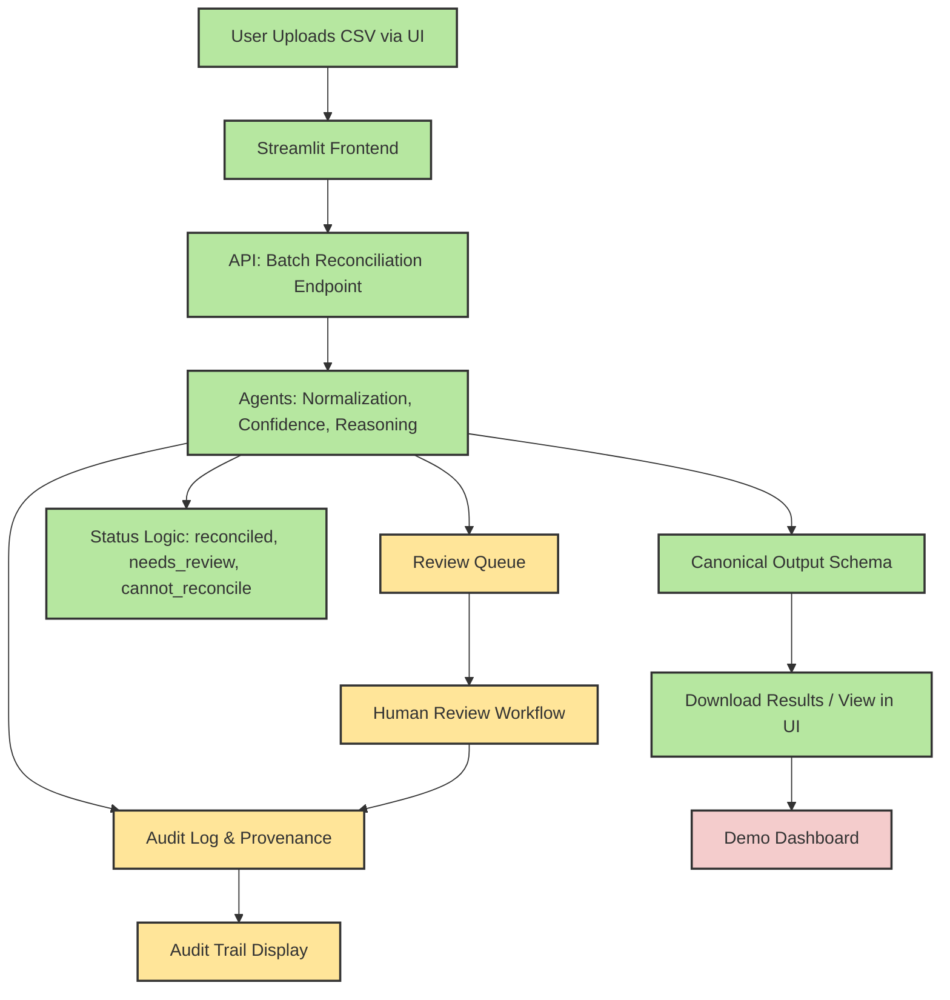

# OncoReconcile AI MVP Overview

## 1. MVP System Diagram

Below is a high-level diagram of the MVP, showing current features (green), in-progress/next week (yellow), and future/blocked (red):

- **Green:** Complete or MVP-ready (current week)
- **Yellow:** In progress or next week
- **Red:** Future/blocked (post-MVP or dependent)

## 2. What We Have Done
- Canonical output schema
- Demo CSV dataset
- Batch reconciliation endpoint
- Status logic (reconciled, needs_review, cannot_reconcile)
- Confidence scoring
- Streamlit UI for upload/results
- Initial test suite
- Documentation and onboarding

## 3. What’s Next (Next Week)
- Audit log and provenance tracking
- Review queue (backend and UI)
- Human review workflow
- Audit trail display in UI
- More demo/test cases

## 4. What’s After (Future)
- Demo dashboard/summary views
- Advanced review/curation features
- Additional data integrations
- Stretch goals (see proposal)

---

**See also:**
- [Issue-to-File Mapping](../meetings/first_team_meeting_agenda.md#issue-to-file-mapping--where-to-start)
- [Architecture and Task Map](task_mapped_architecture.md)
- [Weekly Execution Plan](../project_plan/weekly_execution_plan.md)

---

*This diagram and summary help the team see what’s built, what’s next, and how new issues fit into the overall MVP.*
