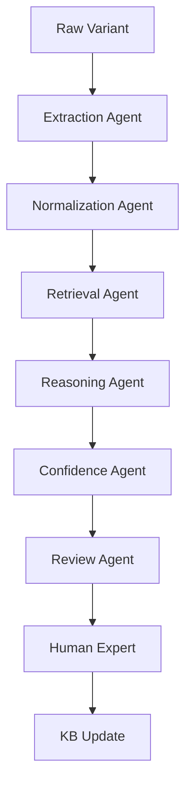

# Architecture Diagrams

This folder contains system architecture diagrams and workflow visualizations.

## Diagrams

### 1. Multi-Agent Pipeline
Shows the flow of variants through all agent stages:
- Extraction → Normalization → Retrieval → Reasoning → Confidence → Review

### 2. Confidence Scoring Model
Illustrates the four-component scoring system:
- Deterministic (30%)
- Semantic Similarity (25%)
- LLM Reasoning (25%)
- Historical Approval (20%)

### 3. Human Review Queue
Demonstrates the review queue assignment logic:
- Fast-Track: High confidence + good history
- Standard: Medium-high confidence
- Escalation: Lower confidence
- Manual Curation: Very low confidence

### 4. Knowledge Base Versioning
Shows KB version control and update tracking:
- Version history
- Rollback capability
- Audit trails

---

## Creating Diagrams

These diagrams can be created using:
- **Mermaid**: For flowcharts and state diagrams
- **PlantUML**: For UML diagrams
- **GraphViz**: For network diagrams
- **Draw.io**: For detailed architecture diagrams

Recommended: Use Mermaid for easy version control in Git.

### Example: Mermaid Diagram

---

See [Architecture Overview](../architecture/architecture_overview.md) for detailed explanations.
